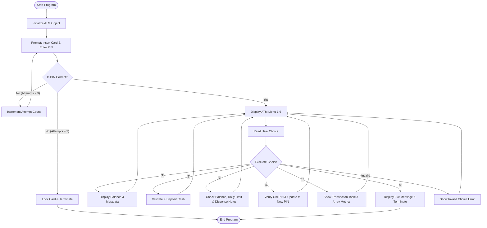

# ACADEMIC PROJECT REPORT

## ATM SIMULATION SYSTEM
**Course**: Python Essentials (First-Year B.Tech Computer Science & Engineering)  
**Semester**: Semester I / II  
**Academic Year**: 2026–2027  

---

### Student Details
- **Student Name**: [Avika Sharma]
- **Roll Number / Registration ID**: [26BCE10201]
- **Department**: Computer Science & Engineering
- **Institution**: [University / College Name]
- **Faculty Guide / Instructor**: [Faculty Guide Name]
- **Date of Submission**: September 29, 2026

---

## 1. Introduction

Automated Teller Machines (ATMs) are critical electronic banking outlets allowing bank customers to complete basic transactions without human branch representatives. The **ATM Simulation System** is a command-line software application developed to model the core workflows of an ATM terminal.

Built entirely using fundamental Python concepts taught in the introductory **Python Essentials** course, this project encapsulates key operations such as credential verification, balance inquiry, monetary deposits, cash withdrawals with automated currency denomination dispensing, security PIN modification, and session-based transaction history logging with descriptive numerical analytics.

---

## 2. Problem Statement

Beginner programming students often learn theoretical concepts—such as operator precedence, data structures, and control flow—in isolation without understanding how they integrate into real-world applications. Furthermore, real banking infrastructure is too complex, secure, and regulated for introductory student development.

There is a need for a simplified, realistic, and completely local banking simulation system that:
1. Recreates fundamental ATM operations cleanly and safely.
2. Implements proper input validation without relying on advanced exception-handling mechanisms (`try/except`).
3. Meaningfully integrates and demonstrates all fundamental Python Essentials syllabus concepts.

---

## 3. Project Objectives

- **Practical Concept Application**: Apply all 25 syllabus topics of the Python Essentials curriculum in a single cohesive software project.
- **Object-Oriented Design**: Encapsulate banking attributes and behaviors within a clean, beginner-friendly `ATM` class without unnecessary magic methods or inheritance.
- **Algorithmic Validation**: Implement defensive input validation using string processing and control statements rather than exception handling.
- **Financial Calculation Accuracy**: Utilize exact arithmetic, floor division (`//`), and modulo (`%`) operators to compute note distribution and balance updates.
- **Automated Verification**: Create an assertion-based test suite using pure Python `assert` statements to verify software correctness.

---

## 4. Technologies Used

- **Programming Language**: Python 3
- **Development Environment**: Standard Terminal / Command Prompt
- **Built-in Modules**: `array`, `sys`, `os`
- **External Dependencies**: None
- **Database / File I/O**: None (Pure in-memory simulation)

---

## 5. Python Concepts Used

The project is specifically architected to reflect direct mastery of the 25 topics covered in the Python Essentials course:

1. **Python Fundamentals**: Consistent variable naming, descriptive docstrings, and modular design.
2. **Input and Output Operations**: `input()` for reading user menu options and numeric values; formatted `print()` statements for receipts and tables.
3. **`type()` Function**: Explicitly checking and displaying internal data types for account balance and identifiers.
4. **Type Conversion**: Transforming string inputs into `float` values for financial amounts and `int` for note quantities.
5. **Arithmetic Operators**:
   - `+` and `-` for updating account balances.
   - `//` (floor division) for calculating how many currency notes to dispense.
   - `%` (modulo) for verifying that deposits and withdrawals are in multiples of Rs. 100.
   - `/` for mixed-type division when computing average transaction size.
6. **Assignment Operators**: Compound assignment operators (`+=` and `-=`) for balance modifications and attempt counters.
7. **Relational / Comparison Operators**: `==`, `!=`, `<`, `>`, `<=`, `>=` for PIN matching, balance adequacy checks, and limit validations.
8. **Logical `and` Operator**: Enforcing multiple simultaneous constraints (e.g., verifying an amount is positive `and` does not exceed available balance).
9. **Logical `or` Operator**: Handling alternative character inputs.
10. **Logical `not` Operator**: Negating boolean validation results to guard against malformed inputs.
11. **Membership Operators**: Using `in` and `not in` with sets (`VALID_MENU_CHOICES`) and frozen sets (`VALID_TRANSACTION_TYPES`).
12. **Identity Operators**: Using `is None` and `is not None` on `get_last_transaction()` to evaluate whether session activity has commenced.
13. **Bitwise Operators**: Using bitmask flags (`SERVICE_WITHDRAW = 1`, `SERVICE_DEPOSIT = 2`, `SERVICE_PIN_CHANGE = 4`) and bitwise AND (`&`) / OR (`|`) to manage ATM service availability.
14. **Division with Mixed Data Types**: Dividing a floating-point total volume by an integer count (`float / int`) resulting in a float average.
15. **Operator Precedence and Associativity**: Enforcing evaluation order with parentheses in financial formulas: `self.daily_limit - (self.total_withdrawn_today + amount)`.
16. **Lists**: Maintaining the dynamic, sequentially appended `transaction_history`.
17. **Tuples**: Storing immutable records `(transaction_type, amount, balance_after)` and fixed currency denominations `(2000, 500, 200, 100)`.
18. **Sets**: Utilizing `{"1", "2", "3", "4", "5", "6"}` for $O(1)$ menu choice membership validation.
19. **Dictionaries**: Storing structured customer details (`holder_name`, `account_number`, `account_type`, `branch`).
20. **Frozen Sets**: Using `frozenset(["Deposit", "Withdrawal", "PIN Change"])` to represent immutable permissible transaction types.
21. **Control Flow Statements**:
   - `if`, `elif`, `else` for menu dispatching and business rule validation.
   - `while` loops for PIN authentication attempts and the main interactive session.
   - `for` loops for iterating over transaction history records and note denominations.
   - `break` to exit loops upon successful PIN entry or session completion.
   - `continue` to handle invalid menu selections gracefully.
22. **Functions**: Decomposing functionality into `display_menu()`, `is_valid_numeric_string()`, `get_positive_amount()`, and `main()`.
23. **Modules and Packages**: Modularizing the project into `atm.py` and `main.py` using standard `import` statements.
24. **Array Data Structure**: Utilizing Python's built-in `array.array('d')` for numeric transaction metrics.
25. **Object-Oriented Programming (OOP)**: Designing a cohesive `ATM` class encapsulating account states and banking operations.

---

## 6. System & Features Description

### 6.1 Authentication Subsystem
- Simulates card insertion and prompts the user for a 4-digit numeric PIN.
- Allows a maximum of three attempts before permanently terminating the session to prevent unauthorized access.

### 6.2 Account Details & Balance Inquiry
- Displays customer metadata stored within a dictionary.
- Displays current ledger balance and demonstrates runtime type inspection via `type()`.

### 6.3 Deposit Subsystem
- Validates that the input represents a valid positive number.
- Checks that the deposit conforms to valid currency multiples (multiples of Rs. 100).
- Updates balance via `+=` and logs the event in both the transaction history list and the numerical array.

### 6.4 Cash Withdrawal Subsystem
- Validates positive amount and checks that sufficient funds exist.
- Enforces a daily limit of Rs. 20,000.
- Calculates an exact breakdown of physical currency notes dispensed using accepted denominations (Rs. 2000, 500, 200, 100).

### 6.5 PIN Management Subsystem
- Verifies current PIN before allowing modifications.
- Ensures the new PIN consists of exactly 4 numeric digits and is not identical to the previous PIN.

### 6.6 Transaction History & Session Metrics
- Displays all historical deposits, withdrawals, and PIN updates formatted as a ledger table.
- Traverses the numeric transaction `array` to output total monetary turnover and average transaction size using mixed-type division.

---

## 7. Project Structure

```text
ATM-Simulation/
│
├── atm.py               # Business logic, ATM class, constants, data structures
├── main.py              # CLI menu, user interaction loop, input validator
├── tests/
│   └── test_project.py  # Standalone assertion test suite
├── README.md            # User manual and syllabus mapping
└── project_report.md    # Academic project report
```

---

## 8. Working Algorithm



---

## 9. Sample Input & Output

### 9.1 Successful Authentication & Deposit
```text
Enter your 4-digit PIN: 1234
>> PIN accepted. Login successful!

Enter your choice (1-6): 2
---------------- CASH DEPOSIT --------------------
Note: ATM accepts cash in multiples of Rs. 100 only.
Enter amount to deposit: Rs. 2500

>> Deposit successful.
>> Deposited Amount: Rs. 2500.00
>> Updated Balance : Rs. 12500.00
--------------------------------------------------
```

### 9.2 Withdrawal with Currency Dispensation
```text
Enter your choice (1-6): 3
---------------- CASH WITHDRAWAL -----------------
Accepted denominations: (2000, 500, 200, 100)
Daily withdrawal limit: Rs. 20000.00
Available Balance     : Rs. 12500.00
Enter amount to withdraw: Rs. 2700

>> Withdrawal successful. Please collect your cash.
>> Withdrawn Amount: Rs. 2700.00
>> Remaining Balance: Rs. 9800.00

Notes Dispensed:
  - Rs.  2000 x 1 note(s)
  - Rs.   500 x 1 note(s)
  - Rs.   200 x 1 note(s)
--------------------------------------------------
```

---

## 10. Testing & Verification

Testing was conducted using plain Python `assert` statements located in `tests/test_project.py`. The suite tests both boundary conditions and nominal workflows without third-party frameworks.

### Summary of Test Cases

| Test Case Function | Condition Tested | Expected Result | Status |
| :--- | :--- | :--- | :---: |
| `test_initial_state()` | Default attributes and empty history | Balance = 10000.0, Last TX `is None` | **PASS** |
| `test_pin_verification()` | Valid and invalid PIN checks | `True` for 1234, `False` for 0000 | **PASS** |
| `test_deposit_operations()` | Standard deposit, negative, zero, non-multiple | Balance updates; invalid inputs rejected | **PASS** |
| `test_withdraw_operations()` | Withdrawal, insufficient funds, daily limit | Correct balance deduction & note counts | **PASS** |
| `test_pin_change()` | Old PIN match, 4-digit length, non-numeric | PIN updated only on valid input | **PASS** |
| `test_bitwise_service_flags()`| Bitwise service masking (`&`, `\|`, `~`) | Services selectively enabled/disabled | **PASS** |
| `test_metrics_and_mixed_type_division()` | Array numerical totals and average | Accurate `float / int` computation | **PASS** |
| `test_course_collections()` | Tuples, sets, and frozen sets membership | Correct immutable collection behavior | **PASS** |

### Execution Command & Output
```bash
python tests/test_project.py
```
```text
==================================================
      RUNNING ATM SIMULATION TEST SUITE           
==================================================
[PASS] test_initial_state
[PASS] test_pin_verification
[PASS] test_deposit_operations
[PASS] test_withdraw_operations
[PASS] test_pin_change
[PASS] test_bitwise_service_flags
[PASS] test_metrics_and_mixed_type_division
[PASS] test_course_collections
==================================================
    ALL TESTS PASSED SUCCESSFULLY! (8/8)          
==================================================
```

---

## 11. Limitations

1. **Session Volatility**: Because file handling and databases are not part of the initial syllabus, all account changes are stored in memory and reset upon program exit.
2. **Single Account Context**: The application is tailored for single-user interactive terminal sessions.
3. **Plaintext Memory**: PIN credentials are stored as standard strings in memory rather than encrypted hashes.

---

## 12. Conclusion

The **ATM Simulation System** successfully satisfies all requirements of a first-year Computer Science project. It demonstrates how foundational Python topics—ranging from basic operators and data structures to beginner-level object-oriented programming—can be organized into a realistic software application. The absence of external dependencies and exception-handling frameworks highlights the power of structured algorithmic design and defensive input checking.

---

## 13. Future Scope

Upon completing subsequent semesters and advanced coursework, the project can be enhanced with:
1. **Persistent Storage**: Utilizing file handling (CSV/JSON) or SQL databases (SQLite/MySQL) to persist user accounts and transactions across sessions.
2. **Graphical User Interface (GUI)**: Implementing an interactive desktop interface using `Tkinter` or `PyQt`.
3. **Cryptographic Security**: Storing security credentials with salt and SHA-256 password hashing.
4. **Networking**: Simulating inter-bank network protocols using client-server socket programming.
